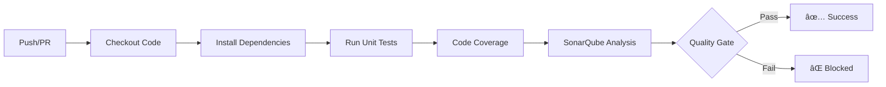

# 📚 Library Management System

> A modern microservices-based library management application built with Django and Vue.js

[](https://sonarcloud.io/summary/new_code?id=MMA-PROJECT-V2_Library-Management-System)
[](https://sonarcloud.io/summary/new_code?id=MMA-PROJECT-V2_Library-Management-System)
[](https://sonarcloud.io/summary/new_code?id=MMA-PROJECT-V2_Library-Management-System)
[](https://sonarcloud.io/summary/new_code?id=MMA-PROJECT-V2_Library-Management-System)
[](https://sonarcloud.io/summary/new_code?id=MMA-PROJECT-V2_Library-Management-System)

---

## 🎯 Project Overview

This project was developed as part of the **Agile Management Methods** course at the University of Boumerdès. It demonstrates the practical application of **SCRUM methodology** and **DevOps practices** in building a full-stack web application.

### Key Learning Objectives

- ✅ Apply **SCRUM** agile methodology for project management
- ✅ Utilize **GitHub** for version control and team collaboration
- ✅ Implement an effective **branching strategy**
- ✅ Integrate **SonarQube** for automated code quality analysis
- ✅ Configure **unit testing** with code coverage metrics
- ✅ Build an automated **CI/CD pipeline** using GitHub Actions

---

## 👥 Development Team

| Name | Role | Responsibilities |
|------|------|------------------|
| **Abdelhafidh** | 🎯 Scrum Master | Sprint planning, team facilitation, impediment removal |
| **Ahmed** | 💻 Backend Developer | Microservices architecture, API development |
| **Houssem** | 🎨 Frontend Developer | Vue.js UI/UX implementation |
| **Aymen** | 🧪 Tester / DevOps | Quality assurance, CI/CD pipeline setup |
| **Amine** | 📋 Product Owner | Requirements gathering, backlog prioritization |

---

## 🏗️ Architecture

Our application follows a modern microservices architecture designed for scalability and maintainability.

### Tech Stack

<table>
  <tr>
    <td align="center"><b>Frontend</b></td>
    <td>Vue.js 3</td>
  </tr>
  <tr>
    <td align="center"><b>Backend</b></td>
    <td>Django + Django REST Framework</td>
  </tr>
  <tr>
    <td align="center"><b>Database</b></td>
    <td>MySQL 5.7+</td>
  </tr>
  <tr>
    <td align="center"><b>Testing</b></td>
    <td>PyTest</td>
  </tr>
  <tr>
    <td align="center"><b>CI/CD</b></td>
    <td>GitHub Actions</td>
  </tr>
  <tr>
    <td align="center"><b>Code Quality</b></td>
    <td>SonarQube</td>
  </tr>
  <tr>
    <td align="center"><b>Project Management</b></td>
    <td>Jira Software</td>
  </tr>
</table>

### 📂 Project Structure

```
Library-Management-System/
│
├── 📁 backend/                              # Backend microservices
│   ├── 📁 api-gateway/                      # API entry point & request routing
│   ├── 📁 user-service/                     # User management microservice
│   ├── 📁 books-service/                    # Book catalog microservice
│   ├── 📁 loans-service/                    # Loan tracking microservice
│   ├── 📁 notifications-service/            # Notification system
│   └── 📁 shared/                           # Shared utilities & configurations
│
├── 📁 frontend/                             # Vue.js client application
│
├── 📁 tests/                                # Integration & E2E tests
│
├── 📁 docs/                                 # Project documentation
│
├── 📁 scripts/                              # Deployment & maintenance scripts
│
├── 📄 docker-compose.yml                    # Docker orchestration
├── 📄 .gitignore                            # Git ignore rules
├── 📄 README.md                             # This file
├── 📄 LICENSE                               # Project license
└── 📄 CONTRIBUTING.md                       # Contribution guidelines
```

---

## 📊 Code Quality Metrics

We maintain high code quality standards through continuous monitoring:

| Metric | Status |
|--------|--------|
| **Bugs** | [](https://sonarcloud.io/summary/new_code?id=MMA-PROJECT-V2_Library-Management-System) |
| **Code Smells** | [](https://sonarcloud.io/summary/new_code?id=MMA-PROJECT-V2_Library-Management-System) |
| **Technical Debt** | [](https://sonarcloud.io/summary/new_code?id=MMA-PROJECT-V2_Library-Management-System) |
| **Duplicated Lines** | [](https://sonarcloud.io/summary/new_code?id=MMA-PROJECT-V2_Library-Management-System) |
| **Lines of Code** | [](https://sonarcloud.io/summary/new_code?id=MMA-PROJECT-V2_Library-Management-System) |
| **Reliability** | [](https://sonarcloud.io/summary/new_code?id=MMA-PROJECT-V2_Library-Management-System) |

---

## 🌿 Git Branching Strategy

We follow **Git Flow**, adapted for agile SCRUM development:

```
main
  ├── develop
  │     ├── feature/add-auth-api
  │     ├── feature/book-search
  │     └── fix/typo-in-dashboard
  └── hotfix/fix-login-crash
```

### Branch Types

| Branch | Purpose | Source | Merge Target |
|--------|---------|--------|--------------|
| `main` | 🔒 Production-ready code | - | - |
| `develop` | 🔄 Integration branch | `main` | `main` |
| `feature/*` | ✨ New features | `develop` | `develop` |
| `fix/*` | 🐛 Bug fixes | `develop` | `develop` |
| `hotfix/*` | 🚨 Critical production fixes | `main` | `main` + `develop` |

**Example branch names:**
- `feature/add-user-authentication`
- `fix/broken-search-results`
- `hotfix/database-connection-error`

---

## 🚀 CI/CD Pipeline

Our automated pipeline ensures code quality and reliability on every commit.

### Pipeline Stages



### What Happens on Each Push:

1. **🔍 Initialization** - Validate project configuration
2. **🧪 Testing** - Execute unit tests with PyTest
3. **📈 Coverage** - Calculate code coverage metrics
4. **🔎 Quality Analysis** - Analyze code with SonarQube
5. **✅ Quality Gate** - Enforce quality standards

---

## 📋 Agile Methodology

### SCRUM Implementation

- **Framework:** SCRUM
- **Tool:** Jira Software
- **Sprint Duration:** 2 weeks
- **Total Sprints:** 4
- **Initial Backlog:** 10+ user stories

### Sprint Breakdown

| Sprint | Focus |
|--------|-------|
| **Sprint 0** | Environment setup, DevOps configuration |
| **Sprint 1** | User authentication & book catalog |
| **Sprint 2** | Loan management system |
| **Sprint 3** | Notifications & reporting |
| **Sprint 4** | Testing, refinement & deployment |

---

## 🚀 Getting Started

### Prerequisites

Ensure you have the following installed:

- **Python** 3.8 or higher
- **Node.js** 14 or higher
- **MySQL** 5.7 or higher
- **Git**

### Quick Installation

#### 1️⃣ Clone the Repository

```bash
git clone https://github.com/Abdelhafidh-87/Library-management-system.git
cd Library-management-system
```

#### 2️⃣ Backend Setup

```bash
cd backend
pip install -r requirements.txt
python manage.py migrate
```

#### 3️⃣ Frontend Setup

```bash
cd frontend
npm install
npm run serve
```

#### 4️⃣ Database Configuration

1. Create a MySQL database
2. Copy `.env.example` to `.env`
3. Update database credentials in `.env`

```env
DB_NAME=library_db
DB_USER=your_username
DB_PASSWORD=your_password
DB_HOST=localhost
DB_PORT=3306
```

#### 5️⃣ Run the Application

**Backend:**
```bash
python manage.py runserver
```

**Frontend:**
```bash
npm run serve
```

Visit `http://localhost:8080` to access the application! 🎉

---

## 📖 Documentation

Detailed documentation is available in the `docs/` directory:

- **Installation Guide** - Complete setup instructions
- **API Documentation** - REST API endpoints reference
- **User Manual** - Application usage guide
- **Development Guide** - Contributing guidelines

---

## 🤝 Contributing

We welcome contributions! Please read our [CONTRIBUTING.md](CONTRIBUTING.md) for:

- Code of conduct
- Development workflow
- Pull request process
- Coding standards

---

## 📄 License

This project is licensed under the terms specified in the [LICENSE](LICENSE) file.

---

## 📞 Contact

For questions or support, please open an issue on GitHub or contact the development team.

---

<div align="center">

**Made with ❤️ by the University of Boumerdès Development Team**

⭐ Star this repository if you find it helpful!

</div>